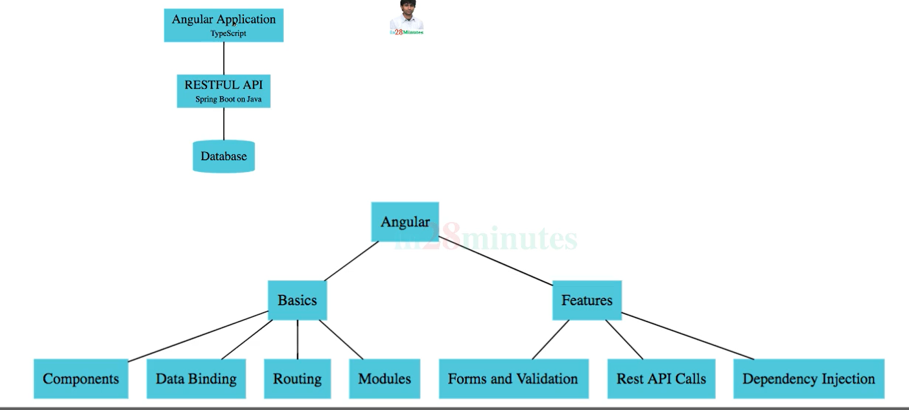
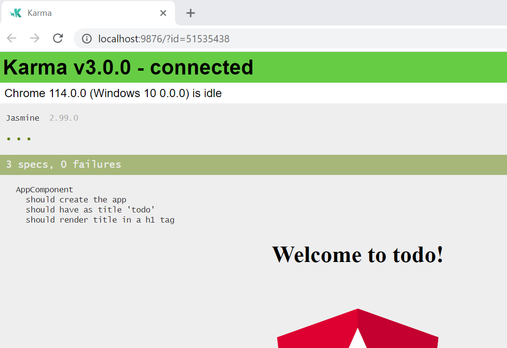

1. Install npm and node
2. Check npm -v
3. Check node -v
4. #### Create a new project
    ---
    * npm init
        * package.json
    * npm install jquery
        * package.json
        * package-lock.json
        * node_modules
5. #### Architecture

6. Installing Angular cli
* npm install -g @angular/cli@7.0.3

7. Check the CLI version
* ng version

8. Resolving error ng disabled
---

[Reference](https://www.c-sharpcorner.com/article/how-to-fix-ps1-can-not-be-loaded-because-running-scripts-is-disabled-on-this-sys/)

9. #### Creating new Angular Project Using CLI
---
* ng new todo
* ng serve

10. #### CLI commands
* ng lint
* ng build
* ng test 

11. #### Resolving build issue - Error message "error:0308010C:digital envelope routines::unsupported"

[Reference](https://stackoverflow.com/questions/69692842/error-message-error0308010cdigital-envelope-routinesunsupported)

