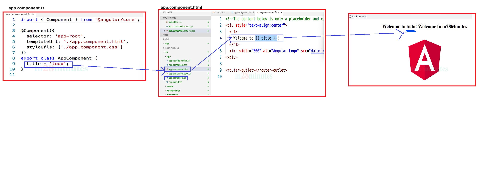

## __MODULE - II__
---

### 1. Install npm and node
```
Check npm -v
Check node -v
```

#### 2. __Create a new project__
    ---
    * npm init
        * package.json
    * npm install jquery
        * package.json
        * package-lock.json
        * node_modules
### 3. __Architecture__


### 4. Installing Angular cli
```
npm install -g @angular/cli@7.0.3
```
### 5. Check the CLI version
```
ng version
```

### __ERROR__ Resolving error ng disabled
----

[Reference](https://www.c-sharpcorner.com/article/how-to-fix-ps1-can-not-be-loaded-because-running-scripts-is-disabled-on-this-sys/)

### 6. Creating new Angular Project Using CLI
----
```
ng new todo 
ng serve 
```

## __MODULE III__
---
### 7. __CLI commands__
* __ng lint__ [Refer Here](https://angular.io/cli/lint)
```
Linting is the process of checking the code quality and style, and finding and fixing errors or potential problems.
 ```
* __ng build__ [Refer Here](https://angular.io/cli/build)
```
* It is used to build and compile our Angular application into a distributable format that can be deployed to a web server or hosting platform.
* Generate output files in a dist directory by default (configurable).
```
* __ng test__ [Refer Here](https://angular.io/cli/test)
```
* Used to run unit tests for our Angular application.
* It provides a convenient way to execute unit tests written using testing frameworks like Jasmine and test runners like Karma.
* The tests are typically located in files with a .spec.ts extension (e.g., app.component.spec.ts).
```
* __ng ete__ [refer Here](https://angular.io/cli/e2e)
```
* Builds and serves an Angular application, then runs end-to-end tests using Protractor.
* code coverage 
```


 ### __ERROR__ Resolving build issue - Error message "error:0308010C:digital envelope routines::unsupported"

[Reference](https://stackoverflow.com/questions/69692842/error-message-error0308010cdigital-envelope-routinesunsupported)

```
choco install nodejs.install --version=16.0.0 --allow-downgrade
```

### __Angular Project Structure__

* __tsconfig.json__ [Refer Here](https://angular.io/guide/typescript-configuration#tsconfig)


```
The tsconfig.json file is a configuration file for the TypeScript compiler. 
It specifies the compiler options that should be used when compiling TypeScript to JavaScript code in our Angular project.
```
* __package.json__


[Refer Here For More Content](https://www.codestack.net/angular/getting-started/package/)

```
 * It is a file that manages the npm dependencies of an Angular project. 
 * It contains information about the project metadata, scripts, dependencies, and devDependencies. 
 * The package.json file is used by the npm client to download and install the packages that are required for the project to run and build. 
```
[Refer Here](https://angular.io/guide/npm-packages)

[Refer Here](https://www.scaler.com/topics/nodejs/node-js-package-json/)

* __main.ts__

```
The main.ts file in Angular 8 is the entry point of the application. 
It is responsible for bootstrapping the root module, which is usually the AppModule, and launching the application in the browser. 

The main.ts file typically imports the following modules and functions:

platformBrowserDynamic: This module provides a method to create a platform that runs the application in a browser with just-in-time (JIT) compilation.

enableProdMode: This function enables the production mode for the application, which disables assertions and other checks within the framework.

AppModule: This module is the root module of the application, which defines how to assemble the application. It usually imports other feature modules and declares components, directives, pipes, and providers.
```


* __index.html__

```
* It is the main file that is loaded in the browser when an Angular application starts.

* It contains the root element of the application, which is usually <app-root></app-root>, where the app component is rendered. 

* It also contains references to the stylesheets and scripts that are required for the application to run. 

* index.html is the entry point of the Angular application, and it is where Angular bootstraps the app module and initializes the app component.
```


[Refer Here](https://dev.to/casperns/how-angular-trigger-indexhtml-and-start-working-1l46)

* __test.ts__

```
It is used to configure the testing environment and run the tests for your Angular application.

It imports some libraries and modules that are necessary for testing, such as Jasmine, Karma, and Angular testing utilities.

It loads all the spec files (files with .spec.ts extension) that contain the test cases for your components, services, pipes, etc.

It executes the tests using the TestBed class, which creates a dynamic testing module that emulates an Angular @NgModule.
```


[Refere Here](https://angular.io/guide/testing)

[Refere Here Unit Test](https://www.digitalocean.com/community/tutorials/angular-introduction-unit-testing)

* __polyfills.ts__

```
Polyfills in angular are few lines of code which make your application compatible for different browsers. The code we write is mostly in ES6(New Features: Overview and Comparison) and is not compatible with IE or firefox and needs some environment setups before being able to be viewed or used in these browsers.

Polyfills.ts was provided by angular to help you do away with need to specifically setup everything.

polyfills.ts also includes polyfills that are needed by Angular and some browsers to support features of modern web platforms. 

Polyfills are scripts that provide functionality that is not natively available in some browsers. For example, polyfills can enable features such as promises, observables, animations, web components, etc. in older browsers
```
[Refere Here](https://angular.io/guide/browser-support)

* __environment.ts__

```
It is used to store the configuration settings for our Angular application, such as the API URL, the production mode, the feature flags, etc.

environment.ts is the default environment file and it is used when we run or build your application in development mode.

We can create different environment files for different environments, such as production, staging, testing, etc. by creating separate files with the same name but different extensions. For example, environment.prod.ts is the environment file for production mode.
```


[Refer Angular](https://angular.io/guide/build)

[Refer Medium](https://medium.com/@hongtatyew/about-environment-ts-in-your-angular-applications-50646ab08c81)

### 8. __Angular Component__

__Project Architecture Component Design__


__Component Tree Diagram__


__Flow Diagram Selector Operation__


__Flow Diag- Interpolation{{Data}}__



